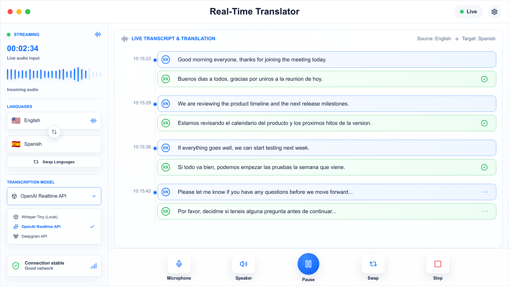

<p align="center">
  
</p>

<h1 align="center">so_intelligence_tools</h1>

<p align="center">
  Local-first AI tools that feel native inside your operating system.
</p>

<p align="center">
  
  
  
  
</p>

---

`so_intelligence_tools` is a suite of AI-powered desktop tools for Linux and Windows, built around global keyboard shortcuts, local services, overlays, clipboard/text automation and realtime audio workflows.

The project is intentionally practical: select text and fix it, capture a screen region and extract text, translate system audio, expose a translated virtual microphone to calls, or experiment with local push-to-talk dictation.

## Table Of Contents

- [Highlights](#highlights)
- [Desktop UI](#desktop-ui)
- [Platform Support](#platform-support)
- [How It Works](#how-it-works)
- [Quick Start On Linux](#quick-start-on-linux)
- [Quick Start On Windows](#quick-start-on-windows)
- [Configuration](#configuration)
- [Roadmap](#roadmap)
- [Current Limitations](#current-limitations)
- [Development](#development)
- [Project Workflow](#project-workflow)
- [License](#license)

## Highlights

| Capability | What it does | Runtime | Status |
| --- | --- | --- | --- |
| Selected text correction | Correct selected text in any app while preserving the original language. | Both | 🟢 Useful now |
| Screenshot OCR | Capture a screen region and copy exact extracted text to the clipboard. | Planned | 🟡 Planned / specced |
| System audio translation | Listen to audio playing on the system and show live Spanish translation. | API | 🟢 Useful now |
| Desktop translation UI | Electron/Vue interface for realtime transcript and translation sessions. | Both | 🟡 In progress |
| Translated virtual microphone | Expose `so_ai_translated_mic` to Slack/Meet/Zoom with passthrough or translated voice. | API | 🟢 Useful now |
| Push-to-talk dictation | Hold a shortcut and dictate text locally with Nemotron ASR ONNX CPU. | Local/on-prem | 🟡 Experimental |
| Local inference API | FastAPI gateway over Ollama or OpenAI-compatible remote providers. | Both | 🟢 Useful now |
| Overlay agent chat | Conversational OS tool launcher and assistant overlay. | Planned | 🔴 Roadmap |

Runtime legend: `Local/on-prem` runs without a third-party inference API, `API` currently depends on an external provider API, and `Both` can be configured for local or API-backed execution.

## Desktop UI

The realtime translation frontend is being shaped as a quiet, work-focused desktop tool: live status, language controls, transcript pairs, model selection and meeting-style controls.

<p align="center">
  
</p>

## Platform Support

Status legend: 🟢 working/useful now, 🟡 partial or experimental, 🔴 not implemented yet.

| Feature | Linux | macOS | Windows |
| --- | :---: | :---: | :---: |
| Local inference API | 🟢 | 🟡 | 🟢 |
| Docker/Ollama backend | 🟢 | 🟡 | 🟡 |
| Global keyboard shortcuts | 🟢 | 🔴 | 🟢 |
| Selected text correction | 🟢 | 🔴 | 🟢 |
| Clipboard/text automation | 🟢 | 🔴 | 🟢 |
| System audio translation | 🟢 | 🔴 | 🔴 |
| Desktop translation UI | 🟡 | 🔴 | 🔴 |
| Virtual translated microphone | 🟢 | 🔴 | 🔴 |
| Push-to-talk dictation | 🟡 | 🔴 | 🔴 |

Linux remains the most complete target. Windows now supports text-focused selected-text correction with native Win32 adapters and a user Startup launcher. The architecture keeps OS-specific code behind adapters so macOS and additional Windows capabilities can be added without rewriting the product model.

## How It Works

```text
Global shortcut / desktop UI
        ↓
Python tool runner
        ↓
OS adapters: Linux or Windows selection, clipboard, keyboard, notifications and platform-specific media adapters
        ↓
Local inference API or realtime ASR/audio provider
        ↓
Text, transcript, translated audio or virtual microphone output
```

The project currently uses:

- **Python + Poetry** for backend/tool runners.
- **FastAPI** for the local inference API.
- **Ollama** for local model serving.
- **LiteLLM/OpenAI-compatible providers** when a remote backend is configured.
- **OpenAI Realtime** for realtime audio translation workflows.
- **PulseAudio/PipeWire compatibility tools** for audio routing on Linux.
- **Electron + Vue** for the desktop translation UI.
- **OpenSpec** for change proposals, specs, tasks and validation evidence.

## Quick Start On Linux

```bash
make install-system-deps
poetry install
poetry run so-intelligence-tools install-linux-desktop-integration
ollama pull gemma4-e2b-longctx:latest
```

The installer creates:

- `~/.config/systemd/user/so-intelligence-tools-api.service`
- `~/.config/systemd/user/so-intelligence-tools-push-to-talk-dictation.service`
- `~/.config/autostart/so-intelligence-tools-desktop-health.desktop`
- GNOME shortcuts for the stable desktop tools

Default shortcuts:

| Tool | Shortcut |
| --- | --- |
| Correct selected text | `Ctrl + Alt + C` |
| Push-to-talk dictation | `Ctrl + Alt + Space` |
| System audio translation | `Ctrl + Alt + Y` |
| Voice translation virtual microphone | `Ctrl + Alt + U` |

Detailed setup:

- [Documentation index](docs/README.md)
- [Getting started on Linux](docs/getting-started-linux.md)
- [Configuration](docs/configuration.md)
- [Troubleshooting Linux](docs/troubleshooting-linux.md)
- [Windows support](docs/windows-support.md)
- [Security and secrets](docs/security-and-secrets.md)

## Quick Start On Windows

```powershell
cd C:\Dev\Active\so_intelligence_tools
poetry install
ollama pull gemma4-e2b-longctx:latest
poetry run so-intelligence-tools install-windows-api-startup
poetry run so-intelligence-tools install-windows-shortcut-listener-startup
```

For the current session, start the API and listener manually or sign out and back in:

```powershell
poetry run uvicorn --app-dir src local_inference_api.main:app --host 127.0.0.1 --port 8010
poetry run so-intelligence-tools listen-shortcuts
```

The supported Windows workflow today is selected text correction with `Ctrl + Alt + C`. If no text is selected, the tool attempts to select and correct the whole focused text input.

## Configuration

Copy `.env.example` to `.env` and add only the keys you actually need.

```bash
cp .env.example .env
```

Local Ollama example:

```env
INFERENCE_PROVIDER=ollama
OLLAMA_BASE_URL=http://127.0.0.1:11434
OLLAMA_MODEL=gemma4-e2b-longctx:latest
OLLAMA_WARMUP_ON_STARTUP=true
```

OpenAI-compatible remote provider example:

```env
INFERENCE_PROVIDER=litellm_proxy
LITELLM_PROXY_URL=https://your-litellm-proxy.example.com
LITELLM_VIRTUAL_KEY=...
LITELLM_MODEL=your/model
```

Realtime audio features require their own API key configuration. Keep real secrets in `.env`; the file is ignored by Git.

## Roadmap

### Now

- Stabilize push-to-talk dictation insertion so text is not lost, reordered or overwritten.
- Improve debug traces for audio timing, ASR emissions and inserted text.
- Finish the realtime translation desktop UI flow.
- Keep hardening virtual microphone audio levels and call setup.

### Next

- Add a proper tools overlay with visible settings.
- Add screenshot OCR as a polished shortcut workflow.
- Add configurable shortcut management from the UI.
- Add runtime health checks for local models, realtime audio and virtual devices.

### Later

- macOS adapters for shortcuts, selection, clipboard and system audio.
- Broader Windows adapters for screenshots, audio routing and voice workflows.
- Local-only realtime voice translation backends.
- Overlay agent chat with access to selected text, screenshots and audio context.

## Current Limitations

- The project is Linux-first overall, with Windows support currently focused on selected text correction and clipboard/text automation.
- Some audio workflows depend on PulseAudio/PipeWire compatibility tools such as `pactl`, `parec` and virtual sink/source modules.
- Push-to-talk dictation is promising but still experimental; the current known issue is text stabilization during live insertion.
- Realtime translation can require paid provider API keys depending on the selected backend.

## Development

```bash
poetry install
poetry run pytest
poetry run ruff check src tests scripts
```

Run the local API manually:

```bash
poetry run uvicorn --app-dir src local_inference_api.main:app --host 127.0.0.1 --port 8010 --reload
```

Run the Docker stack:

```bash
docker compose up -d --build
docker compose exec ollama ollama pull gemma4-e2b-longctx:latest
curl http://127.0.0.1:8000/health
```

## Project Workflow

This repository uses OpenSpec to keep product work explicit:

- proposals live in `openspec/changes/`
- accepted behavior lives in `openspec/specs/`
- completed work is archived with validation evidence

That makes the roadmap more than a wish list: every meaningful feature should have a proposal, design, tasks and validation trail.

## License

MIT. See [LICENSE](LICENSE).
